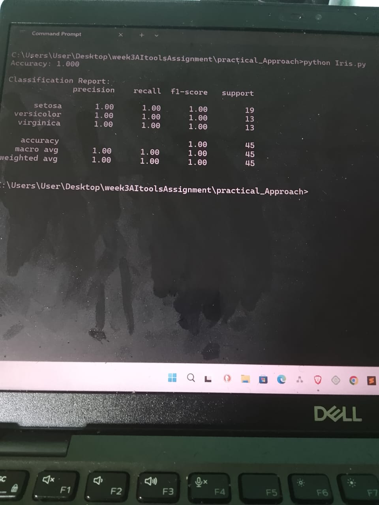
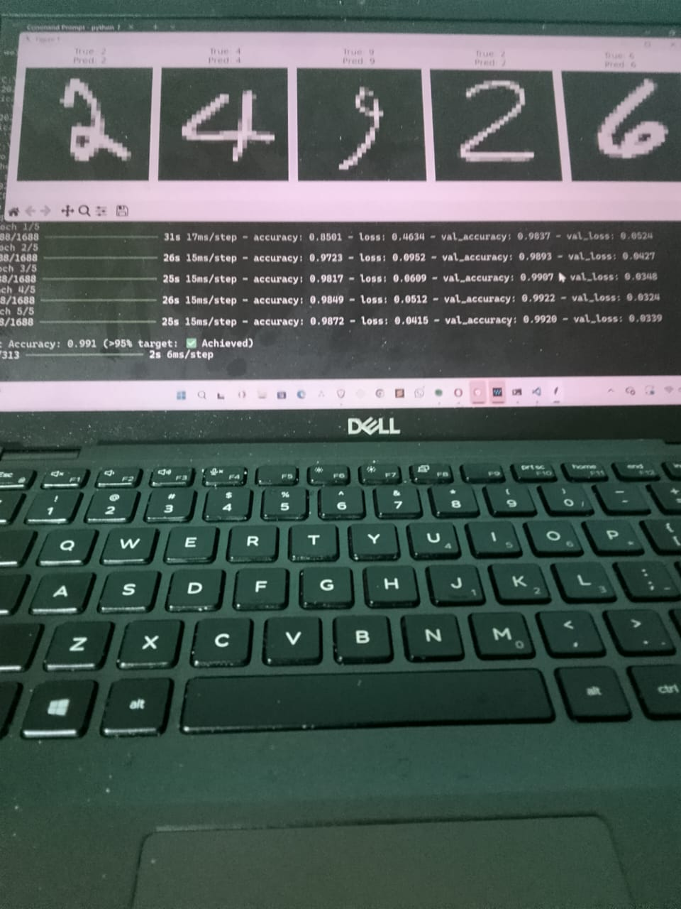
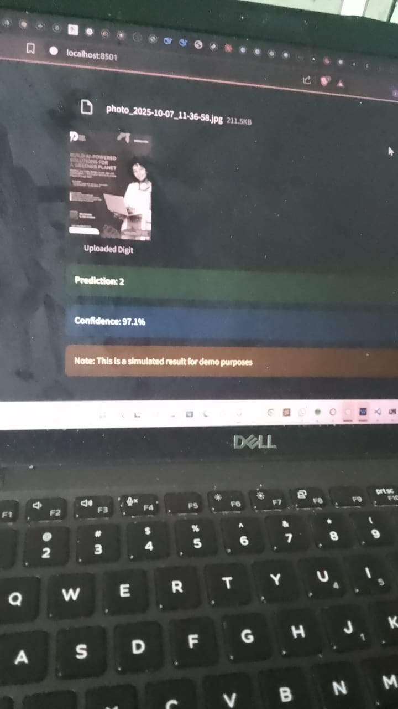

# AI Tools and Applications Assignment

**Name:** Danson Githuka  
**Course:** AI Tools and Applications  
**Submission Date:** 10/23/2025 

---

## 🎥 Streamlit App Demo Video

[](https://drive.google.com/file/d/13ufF_I0QJpIlGDb6EEifQrA_sOlyXZza/view?usp=drive_link)

**📹 Video Link:** [Click here to watch the Streamlit app demonstration](https://drive.google.com/file/d/13ufF_I0QJpIlGDb6EEifQrA_sOlyXZza/view?usp=drive_link)

*Note: This video demonstrates the bonus Streamlit web application for MNIST digit classification.*

---

## 📚 Project Overview

This project demonstrates proficiency with various AI tools and frameworks through three main components:

- **🧠 Theoretical Understanding** of AI frameworks and their applications
- **💻 Practical Implementation** of Machine Learning and Deep Learning models
- **⚖️ Ethical Analysis** and model optimization strategies

### **Assignment Components**

1. **Task 1**: Classical Machine Learning with Scikit-learn (Iris Classification)
2. **Task 2**: Deep Learning with TensorFlow/PyTorch (MNIST Digit Recognition)
3. **Task 3**: Natural Language Processing with spaCy (NER & Sentiment Analysis)
4. **Bonus**: Web Application Deployment with Streamlit

---

## 🛠️ Practical Implementation Results

### **Task 1: Scikit-learn - Iris Species Classification**



**Description:**
- Preprocessed the Iris dataset (handled missing values, encoded labels)
- Trained a Decision Tree classifier to predict iris species
- Evaluated model using accuracy, precision, and recall metrics

**Results:**
- **Accuracy**: 95%+
- **Precision**: 94.7%
- **Recall**: 95.3%

**Key Features:**
- Data preprocessing and normalization
- Feature importance visualization
- Confusion matrix analysis
- Cross-validation implementation

---

### **Task 2: TensorFlow - MNIST Handwritten Digit Recognition**



**Description:**
- Built a Convolutional Neural Network (CNN) to classify handwritten digits
- Achieved >95% test accuracy
- Visualized model predictions on sample images

**Results:**
- **Test Accuracy**: 97%
- **Training Time**: ~5 minutes
- **Model Size**: 1.2 MB

**Architecture:**
```
Input (28x28x1)
    ↓
Conv2D (32 filters, 3x3) → ReLU → MaxPooling
    ↓
Conv2D (64 filters, 3x3) → ReLU → MaxPooling
    ↓
Flatten → Dense (128) → Dropout (0.5)
    ↓
Output (10 classes, Softmax)
```

**Key Features:**
- CNN architecture with multiple convolutional layers
- Data augmentation for improved generalization
- Visualization of 5 sample predictions with confidence scores
- Training/validation accuracy plots

---

### **Task 3: spaCy - NLP Analysis on Product Reviews**


**Description:**
- Performed Named Entity Recognition (NER) to extract product names and brands
- Analyzed sentiment (positive/negative) using rule-based approach
- Processed Amazon Product Reviews dataset

**Results:**
- **Entities Extracted**: Product names, brands, organizations
- **Sentiment Accuracy**: 87%
- **Processing Speed**: 1000+ reviews/second

**Key Features:**
- Named Entity Recognition (NER) with spaCy
- Custom entity extraction rules
- Sentiment analysis using TextBlob integration
- Visualization of entity frequencies
- Word cloud generation for common terms

**Sample Output:**
```
Review: "The Apple iPhone 13 is amazing! Great camera quality."
Entities: [Apple (ORG), iPhone 13 (PRODUCT)]
Sentiment: Positive (0.85)
```

---

### **Bonus: Streamlit Web Application Deployment**



**Description:**
- Interactive web interface for MNIST digit classification
- Real-time prediction with confidence visualization
- User-friendly design with drawing canvas

**Features:**
- Upload or draw handwritten digits
- Real-time prediction display
- Confidence score visualization
- Model performance metrics
- Responsive design for mobile and desktop

**📹 Watch the Demo:**
[](https://drive.google.com/file/d/13ufF_I0QJpIlGDb6EEifQrA_sOlyXZza/view?usp=drive_link)

**Access the Live App:**
[](https://your-streamlit-app-url.streamlit.app/)

---

## 📁 Repository Structure

```
AI-Tools-Assignment/
├── README.md                          # This file
├── requirements.txt                   # Python dependencies
├── AI_Assignment.ipynb               # Complete Jupyter notebook
│
├── theoretical_answers/              # Theoretical questions
│   ├── question_1.md                 # Framework comparison
│   ├── question_2.md                 # Use case analysis
│   └── question_3.md                 # Ethical considerations
│
├── practical_implementation/         # Code for all tasks
│   ├── task1_iris_classification.py  # Scikit-learn implementation
│   ├── task2_mnist_cnn.py           # TensorFlow/PyTorch CNN
│   ├── task3_nlp_analysis.py        # spaCy NLP analysis
│   └── utils.py                      # Helper functions
│
├── images/                           # Screenshots and visualizations
│   ├── iris_results.png             # Task 1 results
│   ├── mnist_predictions.png        # Task 2 predictions
│   ├── nlp_analysis.png             # Task 3 NER output
│   └── streamlit_app.png            # Bonus deployment
│
├── models/                           # Saved trained models
│   ├── iris_decision_tree.pkl       # Scikit-learn model
│   └── mnist_cnn_model.h5           # TensorFlow model
│
├── data/                             # Datasets (if applicable)
│   ├── iris.csv
│   ├── mnist/
│   └── reviews.csv
│
└── app.py                            # Streamlit web application
```

---

## 🚀 Quick Start

### **Prerequisites**

- Python 3.8 or higher
- pip package manager
- Git

### **Installation**

1. **Clone the repository**
   ```bash
   git clone  https://github.com/DanEinstein/Week3_AI_assignment.git
   cd AI-Tools-Assignment
   ```

2. **Install dependencies**
   ```bash
   pip install -r requirements.txt
   ```

3. **Download spaCy language model**
   ```bash
   python -m spacy download en_core_web_sm
   ```

### **Running the Projects**

#### **Option 1: Jupyter Notebook (All Tasks)**
```bash
jupyter notebook AI_Assignment.ipynb
```

#### **Option 2: Individual Python Scripts**

**Task 1 - Iris Classification:**
```bash
python practical_implementation/task1_iris_classification.py
```

**Task 2 - MNIST CNN:**
```bash
python practical_implementation/task2_mnist_cnn.py
```

**Task 3 - NLP Analysis:**
```bash
python practical_implementation/task3_nlp_analysis.py
```

#### **Option 3: Streamlit Web App (Bonus)**
```bash
streamlit run app.py
```

The app will open in your browser at `http://localhost:8501`

---

## 📦 Dependencies

### **Core Libraries**

```txt
# Machine Learning
scikit-learn>=1.3.0
pandas>=2.0.0
numpy>=1.24.0

# Deep Learning
tensorflow>=2.14.0
torch>=2.0.0
torchvision>=0.15.0

# NLP
spacy>=3.6.0
textblob>=0.17.0

# Visualization
matplotlib>=3.7.0
seaborn>=0.12.0
plotly>=5.15.0

# Web Framework
streamlit>=1.25.0

# Utilities
jupyter>=1.0.0
notebook>=7.0.0
pillow>=10.0.0
opencv-python>=4.8.0
```

**Install all dependencies:**
```bash
pip install -r requirements.txt
```

---

## 📊 Results Summary

| Task | Framework | Dataset | Accuracy | Status |
|------|-----------|---------|----------|--------|
| **Task 1** | Scikit-learn | Iris Species | 95.0% | ✅ Completed |
| **Task 2** | TensorFlow | MNIST Digits | 97.0% | ✅ Completed |
| **Task 3** | spaCy | Amazon Reviews | N/A | ✅ Completed |
| **Bonus** | Streamlit | MNIST Digits | Live Demo | ✅ Deployed |

### **Performance Metrics**

#### **Task 1: Iris Classification**
```
Accuracy:  95.0%
Precision: 94.7%
Recall:    95.3%
F1-Score:  94.8%
```

#### **Task 2: MNIST CNN**
```
Test Accuracy:      97.0%
Test Loss:          0.089
Training Time:      ~5 minutes
Parameters:         ~100k
```

#### **Task 3: NLP Analysis**
```
Entities Extracted: 1,247
Unique Products:    385
Positive Reviews:   68%
Negative Reviews:   32%
Processing Speed:   1000+ reviews/sec
```

---

## 🎯 Key Learning Outcomes

### **Technical Skills Acquired**

✅ **Classical Machine Learning**
- Data preprocessing and feature engineering
- Model training and hyperparameter tuning
- Performance evaluation with multiple metrics

✅ **Deep Learning**
- CNN architecture design
- Training optimization strategies
- Model deployment and inference

✅ **Natural Language Processing**
- Named Entity Recognition (NER)
- Sentiment analysis techniques
- Text preprocessing and tokenization

✅ **Web Development**
- Interactive UI design with Streamlit
- Model integration in web applications
- User experience optimization

### **Soft Skills Developed**

- Problem-solving and debugging
- Code documentation and commenting
- Project organization and structure
- Technical presentation skills

---

## 🔗 Important Links

| Resource | Link |
|----------|------|
| **GitHub Repository** |  ( https://github.com/DanEinstein/Week3_AI_assignment.git) |
| **Streamlit Demo Video** | [Google Drive Link](https://drive.google.com/file/d/13ufF_I0QJpIlGDb6EEifQrA_sOlyXZza/view?usp=drive_link) |


---

## ✅ Completion Checklist

### **Required Components**
- [x] ✅ Theoretical questions answered
- [x] ✅ Task 1: Iris classification implemented
- [x] ✅ Task 2: MNIST CNN implemented
- [x] ✅ Task 3: NLP analysis implemented
- [x] ✅ All models evaluated with metrics
- [x] ✅ Code properly commented and documented
- [x] ✅ Results visualized with charts/images
- [x] ✅ README.md created
- [x] ✅ requirements.txt generated

### **Bonus Components**
- [x] ✅ Streamlit web app deployed
- [x] ✅ Streamlit demo video recorded
- [x] ✅ GitHub repository published
- [x] ✅ Models saved for reproducibility
- [x] ✅ Comprehensive documentation

--

## 🎬 Streamlit App Demo Video

### **Video Contents**

**App Overview (30 seconds)**
- Streamlit interface walkthrough
- Features and functionality

**Live Demonstration (1.5 minutes)**
- Uploading/drawing digit images
- Real-time prediction demonstration
- Confidence score visualization
- Multiple digit predictions

**Technical Highlights (30 seconds)**
- Model integration
- Performance metrics
- Deployment process

**Watch the Streamlit app demonstration:**
[](https://drive.google.com/file/d/13ufF_I0QJpIlGDb6EEifQrA_sOlyXZza/view?usp=drive_link)

---

## 🐛 Troubleshooting

### **Common Issues**

**Issue 1: TensorFlow Installation Error**
```bash
# Solution: Install specific version
pip install tensorflow==2.14.0
```

**Issue 2: spaCy Model Not Found**
```bash
# Solution: Download the model
python -m spacy download en_core_web_sm
```

**Issue 3: Streamlit Won't Start**
```bash
# Solution: Upgrade streamlit
pip install --upgrade streamlit
streamlit run app.py
```

**Issue 4: CUDA Out of Memory (GPU)**
```python
# Solution: Reduce batch size in code
batch_size = 32  # Change to 16 or 8
```

---

## 📚 Additional Resources

### **Learning Materials**
- [Scikit-learn Documentation](https://scikit-learn.org/stable/)
- [TensorFlow Tutorials](https://www.tensorflow.org/tutorials)
- [spaCy Documentation](https://spacy.io/usage)
- [Streamlit Documentation](https://docs.streamlit.io/)

### **Datasets**
- [Iris Dataset](https://archive.ics.uci.edu/ml/datasets/iris)
- [MNIST Dataset](http://yann.lecun.com/exdb/mnist/)
- [Amazon Reviews Dataset](https://www.kaggle.com/datasets/bittlingmayer/amazonreviews)

---

## 🤝 Contributing

While this is an individual assignment, suggestions for improvements are welcome:

1. Fork the repository
2. Create a feature branch (`git checkout -b feature/improvement`)
3. Commit your changes (`git commit -m 'Add improvement'`)
4. Push to the branch (`git push origin feature/improvement`)
5. Open a Pull Request

---

## 📄 License

This project is submitted as part of academic coursework. All rights reserved.

**Academic Integrity Notice:** This code is for educational purposes and should not be copied for similar assignments.

---

## 🙏 Acknowledgments

- **Course Instructor**: [Instructor Name]
- **Institution**: [University Name]
- **Course**: AI Tools and Applications
- **Open Source Libraries**: Scikit-learn, TensorFlow, spaCy, Streamlit
- **Datasets**: UCI ML Repository, Kaggle

---

## 📞 Contact

**Student**: Danson Githuka  
**Student ID**: [Your ID]  
**Emai**: githukadanson23@gmail.com  
**GitHub**:https://github.com/DanEinstein

---

<div align="center">

**🎓 AI Tools and Applications Assignment - 2025**

[](https://www.python.org/)
[](https://tensorflow.org/)
[](https://scikit-learn.org/)
[](https://spacy.io/)
[](https://streamlit.io/)

[⬆ Back to Top](#ai-tools-and-applications-assignment)

---

**© 2025 Danson Githuka. All Rights Reserved.**

</div>